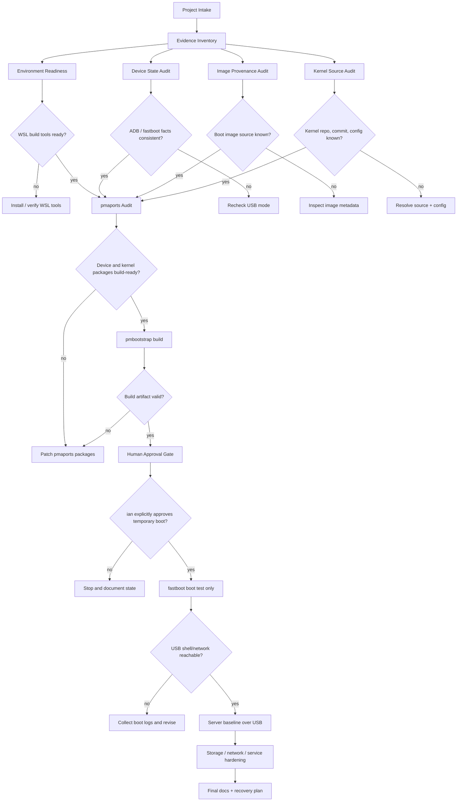

# Project LangGraph (archived 2026-07-22)

> **Superseded.** This is the original 2026-05-28 workflow contract, kept as a
> dated historical record. Its "Current Phase" blockers were all resolved long
> ago. The live governance rules now live in the root
> [`AGENTS.md`](../AGENTS.md).

签名：codex_ian | 2026-05-28 13:10:00 +10:00 Australia/Sydney

This graph is the execution model for the lmi Linux porting project. It is a
workflow contract, not permission to flash the phone.

## Safety Rules

- Never run `fastboot flash`, `fastboot erase`, `fastboot format`, or
  `pmbootstrap flasher flash_*` without explicit approval from ian.
- Prefer read-only inspection and temporary boot tests over permanent writes.
- Raw logs under `logs/` may contain serial numbers, CPU IDs, and bootloader
  tokens. They are ignored by Git.
- Keep recovery material and rollback steps confirmed before boot tests.

## Graph

## Agent Plan

| Agent | Type | Scope | Writes |
|---|---|---|---|
| `orchestrator` | main | Gates, integration, final device commands | yes |
| `evidence-explorer` | explorer | Current repo facts and blockers | no |
| `bootimg-explorer` | explorer | Boot/recovery image metadata | no |
| `kernel-source-explorer` | explorer | Kernel repo, commit, config candidates | no |
| `toolchain-worker` | worker | WSL tool installation scripts | limited |
| `pmaports-worker` | worker | `device-xiaomi-lmi` and `linux-xiaomi-lmi` | limited |
| `build-worker` | worker | pmbootstrap build and logs | limited |
| `safety-auditor` | explorer | Go/No-Go review before device actions | no |

## Current Phase

The project is in the pre-build audit phase.

Open blockers:

- `artifacts/images/boot.img` provenance must be confirmed.
- Kernel repository and commit for `4.19.325-cip128-st12-perf-ga5b3099017ae`
  must be identified.
- Kernel config for `linux-xiaomi-lmi` is missing.
- WSL build dependencies need to be installed or verified.
